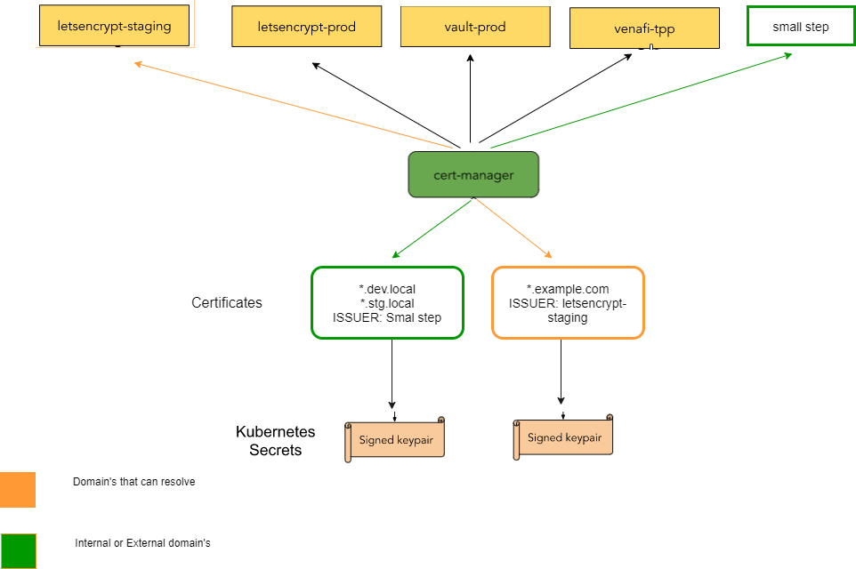
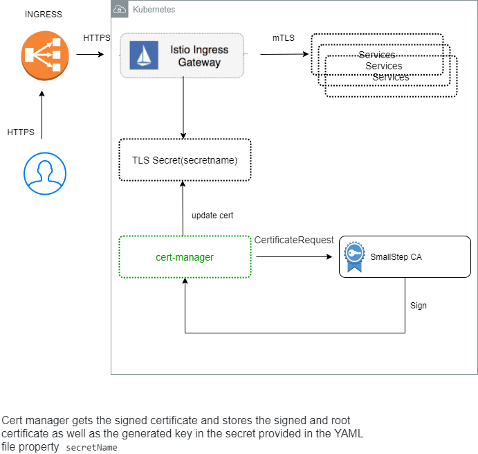

[](https://circleci.com/gh/Gershon-A/ISTIO-cert-manager-and-smallstep-ca)


SmallStep is a very powerful tool that can be used for many proposals and use cases.

In the following example, I will show how to setup a cert-manager with a smallstep, automatically create a certificate, and configure a mutual TLS ISTIO ingress gateway.






### Requirements:
- Kubernetes cluster
- helm (3 and up)
- Kubectl
- istioctl
- ISTIO installed like:
```
istioctl install --set profile=demo 
```
## Atomical installation
Clone repo, then run:
```
chmod +x setup.sh; ./setup.sh --name-space=istio-system
```
## Manual Procedure
### 1. Install crt-manager on kubernetes cluster
```
kubectl apply  -f https://github.com/jetstack/cert-manager/releases/download/v1.2.0/cert-manager.yaml
```
- Verify pods created and running
```
kubectl -n cert-manager get pods --field-selector=status.phase=Running
```
### 2. Install step-certificates helm chart and step-issuer
Repository: https://github.com/smallstep/helm-charts
Repository: https://github.com/smallstep/step-issuer
We going to install the chart in the `istio-system` namespace because ISTIO will lookup for `credentialName` in the same namespace where the `ingressgateway` reside.
- Installing step certificates
```
        helm repo add smallstep  https://smallstep.github.io/helm-charts &&\
        helm repo update && \
        helm install step-certificates smallstep/step-certificates  --namespace istio-system
```
- Output
```
1. Get the PKI and Provisioner secrets running these commands:
   kubectl get -n istio-system -o jsonpath='{.data.password}' secret/step-certificates-ca-password | base64 --decode
   kubectl get -n istio-system -o jsonpath='{.data.password}' secret/step-certificates-provisioner-password | base64 --decode

2. Get the CA URL and the root certificate fingerprint running this command:
   kubectl -n istio-system logs job.batch/step-certificates

3. Delete the configuration job running this command:
   kubectl -n istio-system delete job.batch/step-certificates
```   
- Installing step issuer
```
kubectl apply -f https://raw.githubusercontent.com/smallstep/step-issuer/master/config/crd/bases/certmanager.step.sm_stepissuers.yaml
```
- Then we install the controller:
```
kubectl apply -f https://raw.githubusercontent.com/smallstep/step-issuer/master/config/samples/deployment.yaml
```
- Verify
```
kubectl get -n step-issuer-system all
```
### 3. Adding a StepIssuer
- The provisioner kid 
```
export KID=$(kubectl -n istio-system get -o jsonpath="{.data['ca\.json']}" configmaps/step-certificates-config | jq .authority.provisioners | grep  "kid" |  awk  '{ print $2 }' | cut -f2 -d"\"")
```
- CA root certificate
```
export CABANDLE=$(kubectl -n istio-system get -o jsonpath="{.data['root_ca\.crt']}" configmaps/step-certificates-certs | base64 |  tr -d \\n)
```
- The CA url
```
export URL=$(kubectl -n istio-system get -o jsonpath="{.data['defaults\.json']}" configmaps/step-certificates-config | grep -oP '(?<="ca-url": ")[^"]*')
```
```
kubectl apply -f - <<EOF
apiVersion: certmanager.step.sm/v1beta1
kind: StepIssuer
metadata:
  name: step-issuer
  namespace: istio-system
spec:
  # The CA URL.
  url: $URL
  # The base64 encoded version of the CA root certificate in PEM format.
  caBundle:  $CABANDLE
  # The provisioner name, kid, and a reference to the provisioner password secret.
  provisioner:
    name: admin
    kid: $KID
    passwordRef:
      name: step-certificates-provisioner-password
      key: password
EOF
```
## Test
Clone repo:
```
git clone https://github.com/Gershon-A/ISTIO-cert-manager-and-smallstep-ca
```
- Create namespace with ISTIO sidecar
```
kubectl.exe apply -f example/SmallStep-mutual/namespace.yaml 
namespace/my-app created
```
- Create simple application deployment
```
kubectl.exe apply -f example/SmallStep-mutual/httpbin.yaml 
serviceaccount/httpbin-m created
service/httpbin-m created
deployment.apps/httpbin-m created
```
- Create ISTIO gateway and virtual service
```
kubectl.exe apply -f example/SmallStep-mutual/httpbin-gateway.yaml 
gateway.networking.istio.io/httpbin-m-mygateway created
virtualservice.networking.istio.io/httpbin-m created
```
- Create certificate:
```
kubectl.exe apply -f example/SmallStep-mutual/Certificate.yaml 
certificate.cert-manager.io/httpbin-m-certificate created
```
- Check, that certificate successfully issued
```
kubectl get certificates.cert-manager.io -n istio-system
NAME                    READY   SECRET             AGE
httpbin-m-certificate   True    httpbin-m-secret   3m6s
```
```
kubectl describe certificates.cert-manager.io -n istio-system httpbin-m-certificate
..............
Events:
  Type    Reason     Age    From          Message
  ----    ------     ----   ----          -------
  Normal  Issuing    3m27s  cert-manager  Issuing certificate as Secret does not exist
  Normal  Generated  3m27s  cert-manager  Stored new private key in temporary Secret resource "httpbin-m-certificate-959q9"
  Normal  Requested  3m27s  cert-manager  Created new CertificateRequest resource "httpbin-m-certificate-f8xv8"
  Normal  Issuing    3m26s  cert-manager  The certificate has been successfully issued
  ```

#### CURL test
- Get CA
```
mkdir -p tmp && \
kubectl -n istio-system get secrets httpbin-m-secret -o jsonpath="{.data['ca\.crt']}" | \
base64 -d > tmp/ca-dev.local.pem && \
openssl x509 -in tmp/ca-dev.local.pem -text -noout
```
- Cert
```
mkdir -p tmp && \
kubectl -n istio-system  get secrets httpbin-m-secret -o jsonpath="{.data['tls\.crt']}" | \
base64 -d > tmp/cert-dev.local.pem && \
openssl x509 -in tmp/cert-dev.local.pem -text -noout
```
- Key
```
mkdir -p tmp && \
kubectl -n istio-system get secrets httpbin-m-secret -o jsonpath="{.data['tls\.key']}" | \
base64 -d > tmp/key-dev.local.pem 
```
- Determining the ingress IP and ports
```
export INGRESS_HOST=127.0.0.1
```
- Send SSL request 
```
curl  -v --resolve "httpbin-m.example.com:443:$INGRESS_HOST" --cert tmp/cert-dev.local.pem --key tmp/key-dev.local.pem --cacert tmp/ca-dev.local.pem  "https://httpbin-m.example.com:443/status/418"
```
- Response:
```
* SSL connection using TLSv1.3 / TLS_AES_256_GCM_SHA384
* ALPN, server accepted to use h2
* Server certificate:
*  subject: CN=*.example.com
*  start date: Mar  5 12:39:34 2021 GMT
*  expire date: Mar  6 12:40:34 2021 GMT
*  subjectAltName: host "httpbin-m.example.com" matched cert's "*.example.com"
*  issuer: CN=Step Certificates Intermediate CA
*  SSL certificate verify ok.
* Using HTTP2, server supports multi-use
* Connection state changed (HTTP/2 confirmed)
* Copying HTTP/2 data in stream buffer to connection buffer after upgrade: len=0
* Using Stream ID: 1 (easy handle 0x71e320)
> GET /status/418 HTTP/2
> Host: httpbin-m.example.com
> user-agent: curl/7.71.1
> accept: */*
>
* TLSv1.3 (IN), TLS handshake, Newsession Ticket (4):
* TLSv1.3 (IN), TLS handshake, Newsession Ticket (4):
* old SSL session ID is stale, removing
* Connection state changed (MAX_CONCURRENT_STREAMS == 2147483647)!
< HTTP/2 418
< server: istio-envoy
< date: Fri, 05 Mar 2021 13:06:52 GMT
< x-more-info: http://tools.ietf.org/html/rfc2324
< access-control-allow-origin: *
< access-control-allow-credentials: true
< content-length: 135
< x-envoy-upstream-service-time: 38
< 

    -=[ teapot ]=-

       _...._
     .'  _ _ `.
    | ."` ^ `". _,
    \_;`"---"`|//
      |       ;/
      \_     _/
        `"""`
```
### Any suggestions and improvements are very welcome!
### Buy me a Coffee :) 
ETH: 0x1Fa418c70C5f14b21D00c242Bf369A875F129d12
